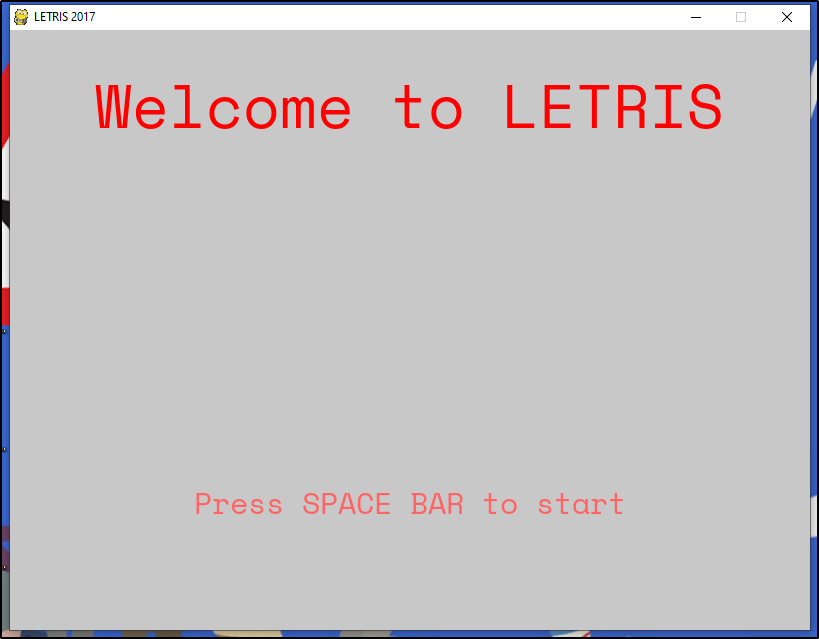
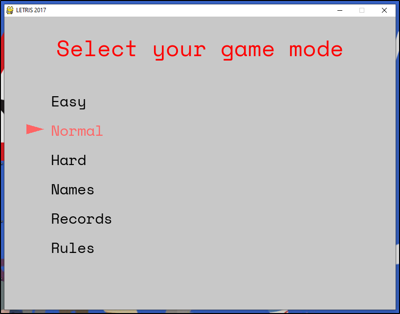
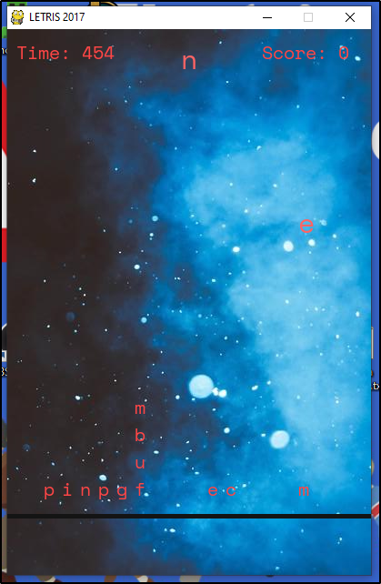

# LETRIS

This is the first programming project I built, for one of my CS courses, so it probably there is room for a lot of improvement. It's similar to Tetris, but characters fall instead of figures and you need to build words (in spanish).

This version is a bit incomplete since I lost the final version, but at least works.

It's built in Python 3, using the PyGame library.

## The game

**The main screen**

**The main menu**

**The game in action**
